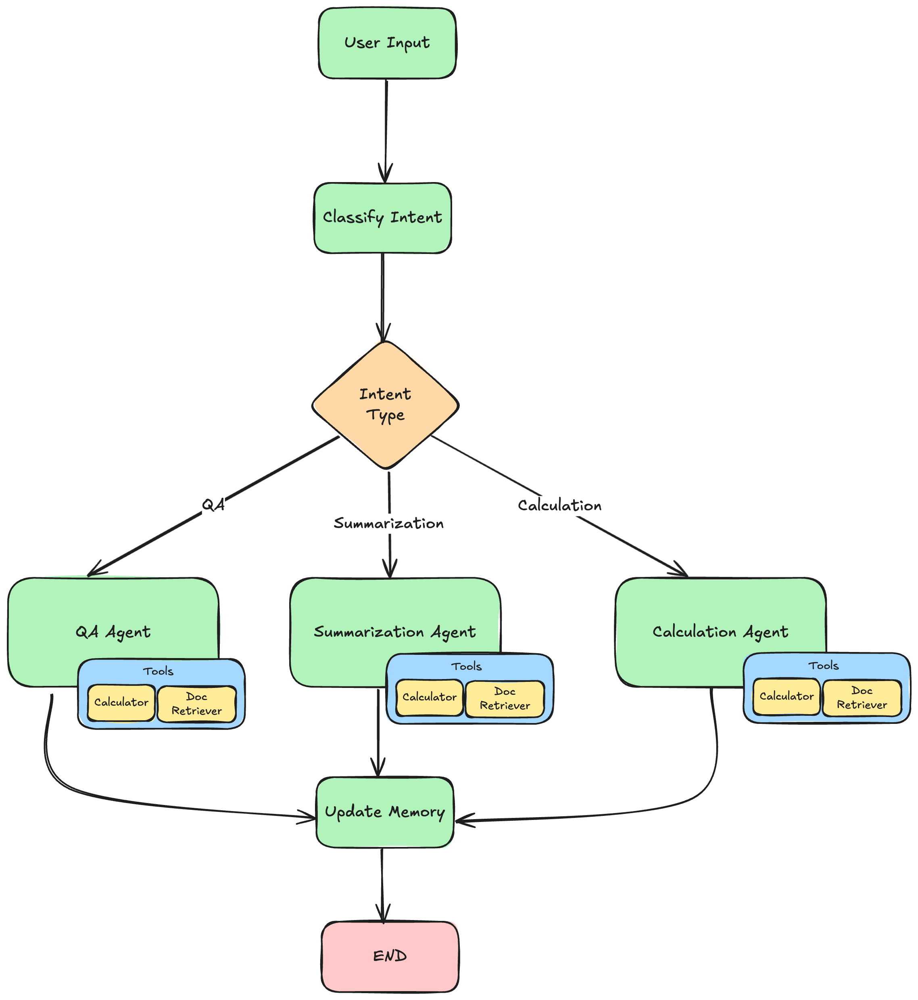

# Report-Building Agent — DocDacity Document Assistant

A multi-agent document assistant built with LangChain and LangGraph. It classifies
what the user is asking for, routes the request to one of three specialised
agents, answers using document tools, and maintains conversation memory across
turns.

The documents in scope are financial and healthcare records — invoices,
contracts and insurance claims — which is the reason several of the design
decisions below prioritise traceability over convenience.

---

## Setup

```bash
pip install -r requirements.txt
cp env.example .env
python main.py
```

After copying, edit `.env` and set two values:

| Variable | Notes |
|---|---|
| `OPENAI_API_KEY` | Your API key. |
| `base_url` | Leave as supplied (`https://openai.vocareum.com/v1`) when using a Udacity/Vocareum key — one beginning with `voc-`. Those keys must be routed through the Vocareum proxy and are rejected by OpenAI's default endpoint. Clear this line if you are using a standard `sk-` key. |

`.env` is git-ignored and is never committed. `env.example` shows the required
variables and contains no real values.

## Project structure

```
Project/
├── src/
│   ├── schemas.py        # Pydantic models for structured output
│   ├── retrieval.py      # Simulated document retrieval
│   ├── tools.py          # Calculator, document search, reader, statistics
│   ├── prompts.py        # Prompt templates and system prompts
│   ├── agent.py          # LangGraph workflow and agent nodes
│   └── assistant.py      # DocumentAssistant, session handling
├── sessions/             # Saved conversation sessions (auto-generated)
├── logs/                 # Tool-call history per session (auto-generated)
├── docs/                 # Architecture diagram
├── main.py               # Interactive CLI entry point
└── requirements.txt
```

---

## Implementation decisions

### 1. Why Pydantic models for the agents' structured responses?

The schema communicates in two directions.

**Outward.** The Pydantic model is converted to a JSON schema and sent to the LLM
as part of the request. The declarations are translated into the schema's own
vocabulary — `Field(ge=0.0, le=1.0)` becomes `"minimum": 0.0` and
`"maximum": 1.0` — so the model is told the valid range before it answers, rather
than being corrected afterwards.

**Inward.** The response arrives as a typed object. Because of this there is no
string parsing and no regular expression anywhere in the graph; each node reads
the fields it needs directly.

### 2. Why is `intent_type` restricted to `qa`, `summarization`, `calculation` and `unknown`?

Restricting the field limits the model's choice and enforces a fixed set of
literal values instead of free text. This has two practical effects.

First, it simplifies everything downstream. The returned value can be used
directly to categorise the request and trigger the next step in the graph, with
no normalisation or cleaning in between.

Second, `unknown` gives the model a way to report that it could not determine
what was being asked. Without it, the model would be forced to select one of the
three working categories even when none of them applies.

### 3. Why does an `unknown` intent fall back to the QA agent?

In my view an unrecognised request should not behave in exactly the same way as a
question. The project instructions specify that anything other than
`summarization` or `calculation` routes to `qa_agent`, so that is what I
implemented.

The choice is defensible: most requests to a document assistant are questions, so
QA is a reasonable default, and the QA agent has both document search and
document reading available. I would still prefer different behaviour. Where the
intent is not clear, the assistant should say that it did not understand the
request and ask the user what they want, instead of answering as though the
request had been understood.

This design also introduces a reporting limitation. Because `unknown` and `qa`
reach the same node, an administrator reading the session records cannot
distinguish them from the executed path alone. Not every request recorded as QA
was genuinely a question.

### 4. Why must every calculation use the calculator tool, even for simple arithmetic?

An LLM does not calculate. It predicts text, and a number it produces is a
plausible continuation rather than the result of an operation.

The correct division of labour follows from that. The model's job is to recognise
that a calculation is required and to call the tool; the tool performs the
calculation exactly; the model receives the result and uses it.

This is the same principle as an orchestrator driving a machine. The orchestrator
does not perform each step itself — it supplies the input and receives the
output. The step that has to be exact is handled by the component built to be
exact.

The benefit is that arithmetic is no longer exposed to prediction error. A basic
mistake in a total cannot occur, because the total is never generated by the
model.

### 5. Why are source document IDs and confidence values included in responses?

This system handles financial and healthcare documents. In that setting the
source of the information and its reliability are not optional features.

A small error produces a disproportionate outcome. Reporting 5% where the
document states 50%, or 0.5%, changes the conclusion entirely. In clinical
records the same is true of a single character: HIV, HPV and HSV differ by one
letter but are distinct conditions with very different implications for the
patient.

This is why each response carries both a confidence score and the source document
IDs. The confidence score signals how much weight to place on the answer, and the
source IDs allow the user to return to the original text and verify it.

---

## State and routing

The workflow is a single-entry, single-exit graph. `classify_intent` is the entry
node. It sends the user input and the conversation history to the LLM, receives a
`UserIntent` object back, and writes `next_step` according to the classified
intent.

Routing is handled by a conditional edge. The `should_continue` function reads
`next_step` from the state, and the routing map sends the request to exactly one
of three agents:

- `qa` → `qa_agent`
- `summarization` → `summarization_agent`
- `calculation` → `calculation_agent`

Only one agent runs per turn. Each of the three then connects to `update_memory`
by a direct edge, and `update_memory` connects to `END`. Every request follows the
same shape regardless of which agent handled it:

```
classify_intent → [qa_agent | summarization_agent | calculation_agent] → update_memory → END
```

`AgentState` is the object that travels through the graph. It carries the current
user input and the message history, the classified intent and the next step, the
response being built and the tools used to build it, the active document IDs and
the conversation summary, the session and user identifiers, and the list of nodes
that have executed.

Two fields use reducers rather than plain assignment. `messages` uses
`add_messages` and `actions_taken` uses `operator.add`, so each node returns only
what it adds and LangGraph merges it into the existing value. Every other field
is replaced by whatever a node returns for it.

`actions_taken` needs one extra step. Because the reducer adds rather than
replaces, and because the state is checkpointed between turns, passing an empty
list in the initial state would not reset it — the empty list would simply be
added to what was already stored. The initial state therefore passes
`Overwrite([])`, which bypasses the reducer for that one update. The reducer is
kept, and each turn still reports only the nodes that ran in that turn.



---

## Memory and InMemorySaver

**What `thread_id` identifies.** `thread_id` is the key the checkpointer stores
state under. It is set to the current session ID, so one session corresponds to
one thread. Two different sessions cannot see each other's state, and the same
session picks up where it left off.

**What is retained between requests.** Everything held in `AgentState` at the end
of a turn is checkpointed and becomes the starting point of the next turn in that
thread — the accumulated messages, the conversation summary and the active
document IDs. This is why the assistant can answer a follow-up question that
refers to a document mentioned earlier without the user naming it again.

**What `InMemorySaver` contributes.** Without a checkpointer each invocation would
begin from an empty state and the assistant would have no memory beyond a single
request. `InMemorySaver` stores the state per `thread_id` in the process's memory,
so `workflow.invoke()` resumes from the previous final state instead of starting
fresh. It also makes `workflow.get_state(config)` available, which is how the
summary and history are read back before a new turn begins.

The limitation is in the name: the storage is in memory only. It exists for the
lifetime of the running process and is lost when the program exits.

**What `update_memory` produces.** After the selected agent has answered,
`update_memory` sends the conversation to the LLM with
`with_structured_output(UpdateMemoryResponse)` and receives back a summary of the
conversation and the list of document IDs relevant to the user's last message.
These are written to state as `conversation_summary` and `active_documents`.

**Why sessions are also written to disk.** Because `InMemorySaver` is volatile, a
durable record is needed as well. After each turn the session is serialised to
`sessions/<session_id>.json`, which preserves the conversation across restarts and
makes each session auditable afterwards. The two mechanisms serve different
purposes: the checkpointer provides continuity *during* a run, the session files
provide a record *after* it.

Tool usage is recorded separately in `logs/`, one file per run, with the input and
output of every tool call.

---

## Structured outputs

Structured output is enforced at every point where the system depends on the
model's answer having a known shape.

- **Intent classification** uses `llm.with_structured_output(UserIntent)`.
- **Memory updates** use `llm.with_structured_output(UpdateMemoryResponse)`.
- **The ReAct agents** pass a `response_format` schema — `AnswerResponse` for the
  QA agent, `SummarizationResponse` for the summarization agent,
  `CalculationResponse` for the calculation agent.

Pydantic enforces both the types and the constraints. `confidence` is declared
with `Field(ge=0.0, le=1.0)` and rejects any value outside that range.
`intent_type` is declared as a `Literal` of the four allowed categories and
rejects anything else, including near-misses such as `"QA"` or `"question"`.

The constraints are not only checked on the way back. They are exported into the
JSON schema sent to the model, so the numeric bounds appear as `"minimum"` and
`"maximum"`, and the allowed categories appear as an `enum`. The model is
constrained while it generates rather than corrected after it has answered.

Receiving a validated object is safer than parsing free-form text for three
reasons. An invalid response fails immediately, at the node that made the call,
instead of travelling further into the graph and failing somewhere that does not
point back to the cause. The graph contains no string parsing and no regular
expressions, so there is no format assumption that can silently drift. And the
routing contract is guaranteed: because `intent_type` can only hold one of four
values, the conditional edge cannot receive a value it has no mapping for.

---

## The calculator tool and expression safety

The calculation agent is instructed to use the calculator for every calculation,
however simple. The tool itself does not trust its input.

The expression is generated by the LLM from the user's message, so the user
influences it indirectly. Validation is therefore treated as a security boundary,
not a formatting check. Two layers are applied before evaluation:

1. **A character whitelist.** Only digits, `+ - * / ( ) .` and whitespace are
   permitted. Because letters and underscores are excluded, expressions such as
   `__import__('os').system(...)` or `(1).__class__` are rejected before they
   reach `eval` — they cannot be expressed in the allowed alphabet at all.
2. **Exponentiation is blocked, and `eval` runs with no builtins.** `**` is
   rejected because it passes a character whitelist while allowing an expression
   such as `9**9**9` to consume unbounded time and memory. `eval` is called with
   an empty builtins mapping so that no global names are reachable.

Errors are returned as strings rather than raised, so the agent can recover. This
happens in practice — see the calculation example below, where the first
expression was rejected for containing a thousands separator and the model
retried with a valid one.

---

## Example conversations

The complete captured terminal run is available in
[EXECUTION_TRANSCRIPT.md](./EXECUTION_TRANSCRIPT.md). Session record:
`sessions/d13860d6-0c6f-43ed-8a86-8640fa5972fe.json`. Tool log:
`logs/tool_usage_20260810_102312.json`.

### Q&A example

```
User request:   Who are the parties in contract CON-001?

Assistant:      The parties in contract CON-001 are:
                - Provider: DocDacity Solutions Inc.
                - Client:   Healthcare Partners LLC

Intent:         qa (confidence: 0.95)
Sources:        CON-001
Tools used:     document_reader
```

### Summarization example

```
User request:   Summarize insurance claim CLM-001.

Assistant:      Insurance Claim Summary: CLM-001
                - Claim Number:     78901
                - Claimant:         John Doe
                - Policy Number:    POL-456789
                - Date of Incident: February 10, 2024
                - Type of Claim:    Medical Expense Reimbursement

                Expenses:
                - Hospital Visit:          $1,200
                - Diagnostic Tests:          $800
                - Medication:                $150
                - Follow-up Consultation:    $300

                - Total Claim Amount: $2,450
                - Status:             Under Review

Intent:         summarization (confidence: 0.95)
Sources:        CON-001, CLM-001
Tools used:     document_reader
```

### Calculation example

```
User request:   Calculate 10% of the Total Due in invoice INV-002.

Assistant:      10% of the Total Due in invoice INV-002 is $6,930.00.
                - Total Due:   $69,300
                - Calculation: 69,300 x 0.10 = 6,930
                The values were obtained from document INV-002.

Intent:         calculation (confidence: 0.95)
Sources:        CON-001, CLM-001, INV-002
Tools used:     document_reader, calculator, calculator
```

The calculator was called twice on this turn, which shows the error handling
working end to end:

```
'69,300 * 0.10'  ->  Error: Invalid characters in expression.
                     Only numbers and +, -, *, /, (, ) are allowed.
'69300 * 0.10'   ->  6930.0
```

The first expression contained a thousands separator, which the whitelist
rejects. The tool returned the error as a string instead of raising, the agent
read it, corrected the expression and retried. The final answer is therefore
produced by the calculator, not by the model.

---

## Known limitations

- **`InMemorySaver` is volatile.** Conversation state survives between turns but
  not between runs of the program. The session files in `sessions/` preserve the
  record, but the checkpointed graph state itself is lost on exit. A persistent
  checkpointer backend would be required for a real deployment.
- **`unknown` and `qa` are behaviourally identical.** As described in decision 3,
  the two cannot be distinguished from the executed path alone, although
  `UserIntent` still records the classification, its confidence and its reasoning.
- **`sources` is optional in the generated schema.** Because the field is declared
  with `default_factory=list`, it does not appear in the JSON schema's `required`
  list, so the model may omit it and it becomes an empty list. An answer with no
  citations is therefore indistinguishable from a field the model did not fill.
- **The calculator rejects thousands separators.** `69,300` is not accepted and
  the agent has to retry with `69300`. This is a consequence of the strict
  whitelist and costs an extra tool call, as shown above.
